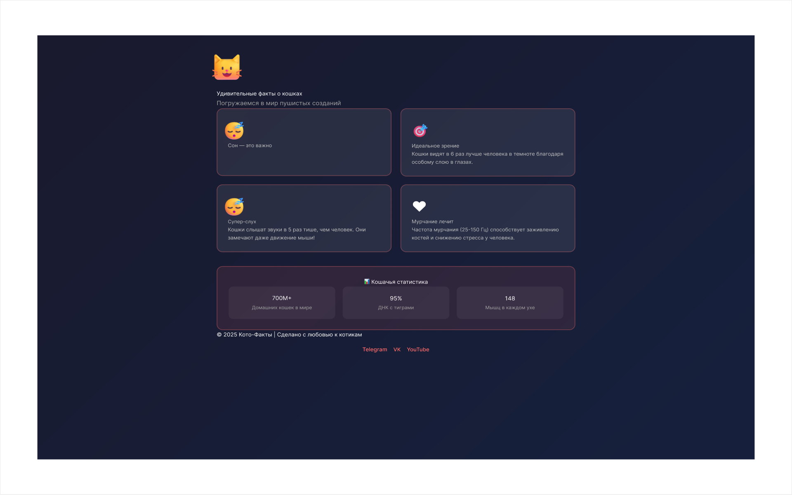
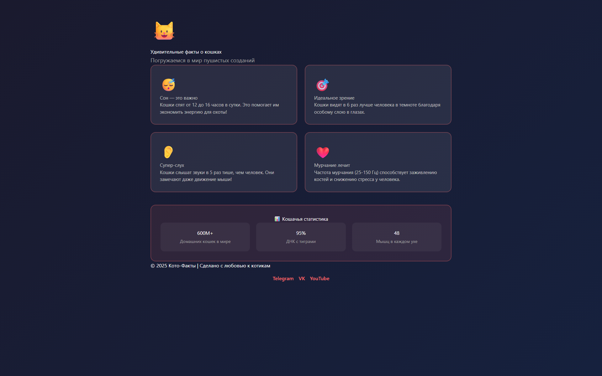
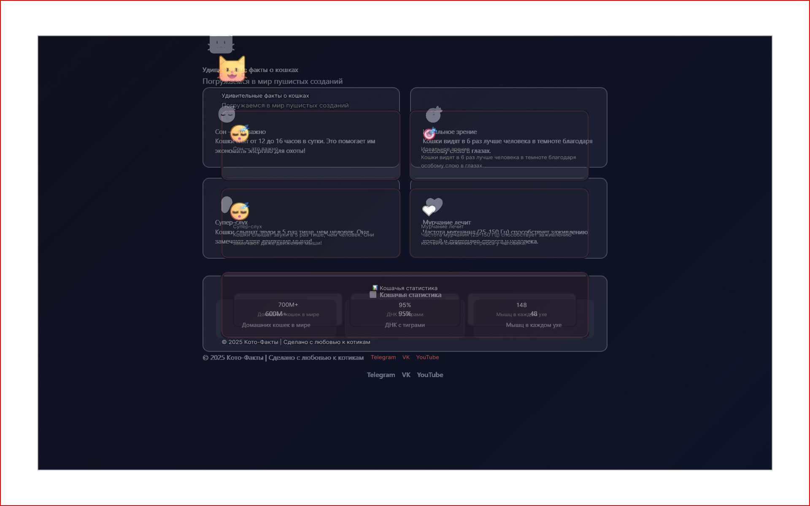
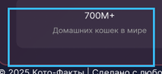
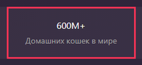
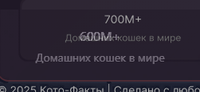
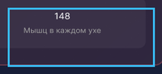
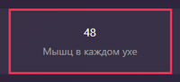
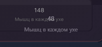
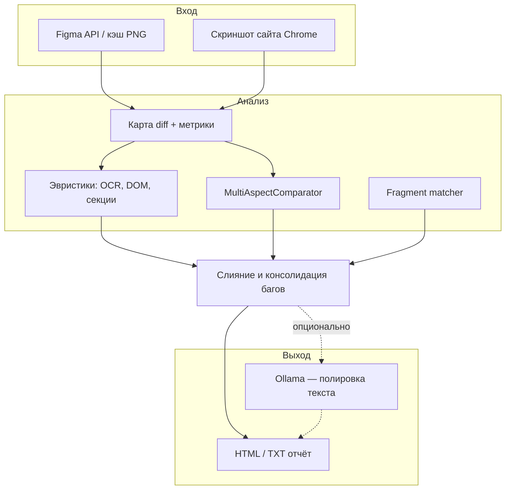

# Интеллектуальная система сверки вёрстки с макетом Figma

**Курсовая работа** · ФГБОУ ВО «Воронежский государственный университет», факультет компьютерных наук  
Направление 09.03.02 «Информационные системы и технологии», 6 семестр  
**Автор:** О. С. Петрыкина · **Руководитель:** Ушаков

Автоматизированная проверка соответствия веб-страницы макету **Figma**: скриншот в Chrome, пиксельный diff, OCR и эвристики по DOM, нейросеть **MultiAspectComparator** (6 аспектов сходства), опционально **Ollama** для формулировок в отчёте. Демо-страница — лендинг «Кото-Факты» в [`site/`](site/).

| Компонент | Назначение |
|-----------|------------|
| Figma API | Экспорт кадра макета (`shots/figma_cache/`) |
| Selenium + Chrome | Скриншот страницы в заданном окне |
| OpenCV / diff | Карта отличий, метрики, горячие зоны |
| MultiAspectComparator | Фильтрация ложных diff по кропам 224×224 |
| Ollama | Полировка русского текста баг-репорта (опционально) |

**Репозиторий:** [github.com/PetrykinaOlgaQA/BD](https://github.com/PetrykinaOlgaQA/BD)

---

## Курсовая работа

| Формат | Файл |
|--------|------|
| PDF | [документы/курсовая.pdf](документы/курсовая.pdf) |
| DOCX | [документы/курсовая.docx](документы/курсовая.docx) |

---

## Презентация

| Формат | Файл |
|--------|------|
| PowerPoint | [документы/презентация.pptx](документы/презентация.pptx) |
| PDF | [документы/презентация.pdf](документы/презентация.pdf) |

---

## Демонстрация работы алгоритма

<video src="документы/Видео%20работы%20программы.mp4" controls width="720">
  Ваш браузер не поддерживает встроенное видео.
  <a href="документы/Видео работы программы.mp4">Скачать видео (MP4)</a>
</video>

Файл: [документы/Видео работы программы.mp4](документы/Видео%20работы%20программы.mp4)

---

## Артефакты последнего тестирования

**Прогон:** 2026-06-02, 20:16 UTC · окно **1920×1201** px · статус **FAIL** (намеренные расхождения демо-сайта с макетом)

| Метрика | Значение |
|---------|----------|
| MSE | 0,170 |
| Изменённые пиксели | 23,18 % |
| Найдено замечаний | 5 |

**Полный HTML-отчёт** (локально, после прогона): [`reports/qa_report_20260602_201616.html`](reports/qa_report_20260602_201616.html) · копия: [`reports/qa_report_last.html`](reports/qa_report_last.html)

Папка прогона в `reports/` (в git не входит): `witness_1780430726840/`, `bug_table_20260602_201616/`.

Ключевые кадры (ASCII-путь для корректного отображения на GitHub): [`docs/artifacts/last-run/`](docs/artifacts/last-run/)

### Сводка кадров (макет · сайт · diff)

| Макет (baseline) | Скриншот сайта | Карта diff |
|------------------|----------------|------------|
|  |  |  |

### Примеры найденных багов

1. **Статистика:** макет «700M+» → сайт «600M+»
2. **Статистика:** макет «148» → сайт «48»
3. **Шапка:** логотип-котик не совпадает с макетом
4. **Карточка 3:** другое эмодзи (👂 на сайте)
5. **Карточка 4:** другое эмодзи/стиль (❤️ на сайте)

| Ожидаемый (макет) | Факт (сайт) | Diff в зоне |
|-------------------|-------------|-------------|
|  |  |  |
|  |  |  |

---

## Как это работает



| Этап | Что делает |
|------|------------|
| **Figma** | Экспорт кадра макета (или чтение из кэша `shots/figma_cache/`) |
| **Скриншот** | Selenium + Chrome, размер окна как в макете |
| **Diff** | Пиксельное сравнение, допуск сдвига и шума, горячие зоны |
| **Эвристики** | OCR макета vs `innerText` DOM: цифры, M+, %, эмодзи, логотип |
| **Нейросеть** | Оценка пар кропов по 6 аспектам — отсев ложных diff |
| **Ollama** | Опционально улучшает русские формулировки в отчёте |

### MultiAspectComparator

Модель сравнивает **пару фрагментов** (кроп макета + кроп сайта) **224×224**. Вход — 4 канала (яркость Figma, яркость сайта, |разность|, средняя яркость), backbone MobileNetV3-Small, шесть голов: `overall`, `text`, `image`, `layout`, `typography`, `color`. Обучение на [Rico](https://interactionmining.org/rico) + синтетика — см. [`docs/TRAINING_RICO.md`](docs/TRAINING_RICO.md).

---

## Быстрый старт

### Требования

- Python **3.10+**
- **Google Chrome** (Selenium)
- Токен Figma → `FIGMA_ACCESS_TOKEN` ([получить](https://www.figma.com/developers/api#access-tokens))
- **Ollama** — только если нужна полировка текста отчёта

### Установка

```powershell
cd "путь\к\нейросеть"
pip install -r requirements.txt
pip install -r requirements-comparator.txt
```

Скопируйте `config.example.json` → `config.json` (в git не коммитится).

### Запуск QA

```powershell
cd site
python -m http.server 8080

cd ..
$env:FIGMA_ACCESS_TOKEN = "ваш_токен"
python run_tests.py
```

| Флаг | Эффект |
|------|--------|
| `--no-gemma` | Без Ollama |
| `--no-comparator` | Без MultiAspectComparator |
| `--url http://...` | Другой URL без правки конфига |

Результат: `reports/qa_report_*.html`, артефакты в `reports/witness_*`.

### Веб-панель и десктоп

```powershell
python web_server.py    # http://127.0.0.1:8765
python app.py           # окно Tkinter
```

---

## Структура проекта

```
нейросеть/
├── run_tests.py              # CLI: один прогон QA
├── config.example.json
├── src/
│   ├── pipeline.py           # Figma + скрин + отчёт
│   ├── section_compare.py    # Эвристики по секциям
│   └── comparator/           # MultiAspectComparator
├── site/                     # Демо «Кото-Факты»
├── документы/                # Курсовая, презентация, видео
├── docs/artifacts/           # Кадры последнего прогона (для README на GitHub)
├── shots/                    # Скриншоты (не в git)
└── reports/                  # Отчёты (не в git)
```

---

## Безопасность

- `config.json`, `.env`, токены — **не коммитить** (см. `.gitignore`).
- Токен Figma только в переменной окружения `FIGMA_ACCESS_TOKEN`.
