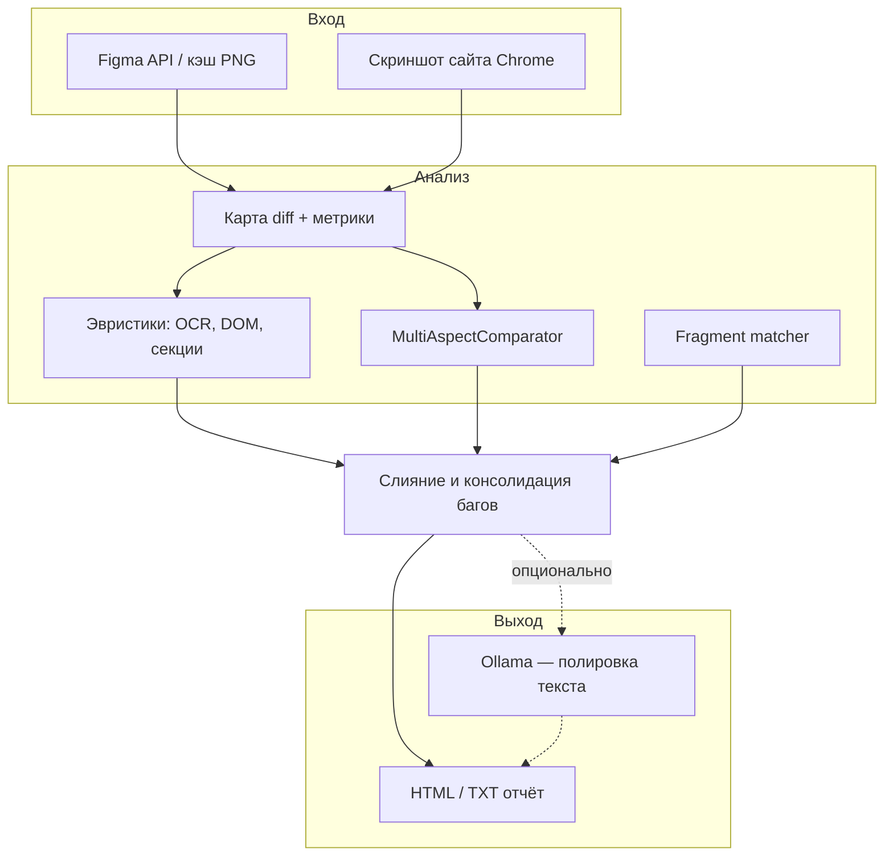
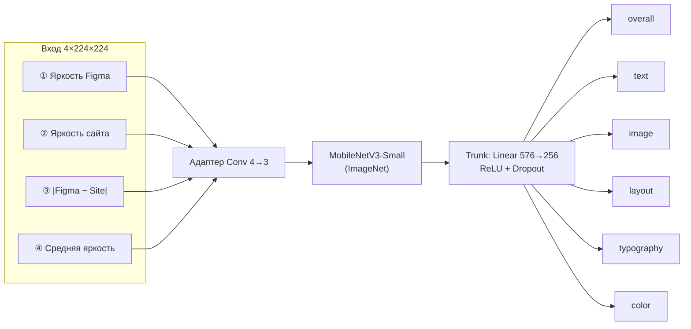

# Визуальный QA: сайт ↔ макет Figma

Автоматическая проверка вёрстки: система снимает страницу в браузере, сравнивает её с кадром из **Figma**, находит расхождения и формирует **HTML-отчёт** с кропами и описанием багов.

> Демо-вёрстка лежит в папке [`site/`](site/) — см. [`site/ЗАПУСК.txt`](site/ЗАПУСК.txt).

---

## Как это работает



| Этап | Что делает |
|------|------------|
| **Figma** | Экспорт кадра макета (или чтение из кэша `shots/figma_cache/`) |
| **Скриншот** | Selenium + Chrome, размер окна как в макете |
| **Diff** | Пиксельное сравнение, допуск сдвига и шума, горячие зоны |
| **Эвристики** | OCR макета vs `innerText` DOM: цифры, M+, %, эмодзи, логотип |
| **Нейросеть** | Оценка пар кропов по 6 аспектам — отсев ложных diff |
| **Ollama** | Опционально улучшает русские формулировки в отчёте |

---

## MultiAspectComparator — схема нейросети

Модель сравнивает **одну пару фрагментов** (кроп макета + кроп сайта) размером **224×224**.



Каждая «голова» выдаёт **вероятность сходства** от 0 до 1 (после sigmoid):

| Выход | Смысл |
|-------|--------|
| `overall_similarity` | Общее визуальное совпадение кропа |
| `text_match` | Текст / цифры |
| `image_match` | Иконки, эмодзи, картинки |
| `layout_match` | Расположение, геометрия |
| `typography_match` | Шрифт, начертание |
| `color_match` | Цвет |

**Обучение:** датасет [Rico](https://interactionmining.org/rico) + синтетические пары с аугментациями (смена цифр, пропажа текста, сдвиг ≤15 px). Подробнее — [`docs/TRAINING_RICO.md`](docs/TRAINING_RICO.md).

---

## Какие баги находит система

| Категория | Примеры |
|-----------|---------|
| **Текст и цифры** | `700M+` → `600M+`, другой процент, заголовок/абзац |
| **Эмодзи и иконки** | Другой символ в карточке, логотип-котик в шапке |
| **Вёрстка** | Заметные отличия по diff (крупные сдвиги блоков) |
| **Типографика / цвет** | Шрифт, цвет текста (computed style + визуальные кропы) |

В отчёте у каждого бага: **ожидаемый кроп (макет)** · **факт (сайт)** · **фрагмент diff** · текст с привязкой к блоку.

---

## Роли компонентов

### Нейросеть (MultiAspectComparator)

- **Не** генерирует текст и **не** заменяет OCR.
- Смотрит на **подозрительные зоны** из diff и отвечает: «похоже / не похоже» по аспектам.
- Помогает отфильтровать ложные срабатывания и добавить пропущенные регионы.

### Ollama (Gemma / LLaVA и др.)

- **Опциональна** (`python run_tests.py --no-gemma` — без неё).
- **Полировка** русских формулировок баг-репорта.
- Опционально **vision**: разбор карты diff по картинке.
- Черновик багов формируют diff + OCR + правила + нейросеть.

### Эвристики (без LLM)

- `section_compare` — секции страницы, stat-item, эмодзи, логотип.
- EasyOCR / Tesseract на кропах макета.
- Сопоставление с DOM сайта (`innerText`, bbox).

---

## Быстрый старт

### Требования

- Python **3.10+**
- **Google Chrome** (Selenium)
- Токен Figma → переменная `FIGMA_ACCESS_TOKEN` ([получить](https://www.figma.com/developers/api#access-tokens))
- **Ollama** — только если нужна полировка текста отчёта

### Установка

```powershell
cd "путь\к\нейросеть"
pip install -r requirements.txt
pip install -r requirements-comparator.txt   # PyTorch, EasyOCR — для нейросети
```

Скопируйте `config.example.json` → `config.json` (в git не коммитится).

| Поле | Смысл |
|------|--------|
| `url_site` | URL страницы для скриншота |
| `window_size` | Размер окна браузера `[ширина, высота]` |
| `figma.file_key` | Ключ из ссылки Figma |
| `figma.node_id` | `19-2` в URL → `19:2` в конфиге |
| `figma.design_png` | Кэш PNG макета |
| `comparator.weights` | Веса `multi_aspect_comparator_best.pt` |

### Запуск QA

```powershell
# 1. Демо-сайт (в отдельном окне)
cd site
python -m http.server 8080

# 2. Прогон
cd ..
$env:FIGMA_ACCESS_TOKEN = "ваш_токен"
python run_tests.py
```

Флаги:

| Флаг | Эффект |
|------|--------|
| `--no-gemma` | Без Ollama |
| `--no-comparator` | Без MultiAspectComparator |
| `--url http://...` | Другой URL без правки конфига |

Результат: `reports/qa_report_*.html`, артефакты в `reports/witness_*`.

### Обучение компаратора

```powershell
# Генерация датасета Rico (путь к combined/)
python scripts/generate_rico_dataset.py --rico-root "C:\path\to\rico\combined" --max-screens 2500

# Обучение
python -m src.comparator.training.train
```

Веса сохраняются в `weights/multi_aspect_comparator_best.pt` (в git не входят).

---

## Структура проекта

```
нейросеть/
├── run_tests.py              # CLI: один прогон QA
├── run_comparator.py         # Отдельный прогон компаратора
├── config.example.json       # Шаблон конфигурации
├── config/comparator.yaml    # Гиперпараметры обучения
├── src/
│   ├── pipeline.py           # Оркестрация: Figma + скрин + отчёт
│   ├── section_compare.py    # Эвристики по секциям и stat-item
│   ├── bug_consolidate.py    # Слияние и приоритет багов
│   ├── block_crops.py        # Кропы для HTML-таблицы
│   ├── report.py             # HTML-отчёт
│   ├── gemma_client.py       # Ollama
│   └── comparator/           # MultiAspectComparator
│       ├── models/multi_aspect.py
│       ├── inference/        # compare, OCR, merge_report
│       └── training/         # train, rico_dataset, synthetic
├── scripts/
│   └── generate_rico_dataset.py
├── docs/
│   └── TRAINING_RICO.md
├── site/                     # Демо-вёрстка «Кото-Факты»
├── shots/                    # Скриншоты (не в git)
└── reports/                  # Отчёты (не в git)
```

---

## Веб-панель и десктоп

```powershell
$env:FIGMA_ACCESS_TOKEN = "…"
python web_server.py    # http://127.0.0.1:8765
python app.py           # окно Tkinter
```

---

## Безопасность

- `config.json`, `.env`, токены — **не коммитить** (см. `.gitignore`).
- Токен Figma только в переменной окружения `FIGMA_ACCESS_TOKEN`.

---

## Лицензия и автор

Дипломный проект. Репозиторий: [github.com/PetrykinaOlgaQA/BD](https://github.com/PetrykinaOlgaQA/BD).
